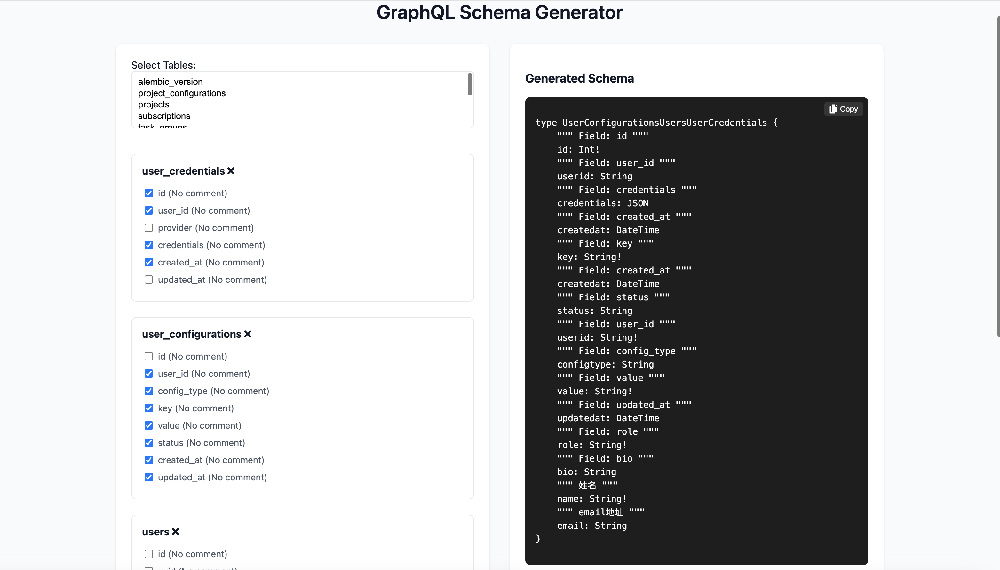

# db2gql

A simple tool to convert database column types to GraphQL types



## Installation

1.  Clone the repository

```bash
git clone https://github.com/xxlv/db2gql.git
cd db2gql
```

2. Install dependencies

```
    go mod tidy &&
    cd gqlserver && npm install
```

3. Run

```shell
    go run . --dbname="graphql_schema" --sandbox=true
```
